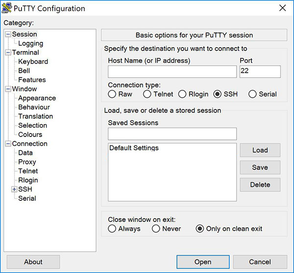
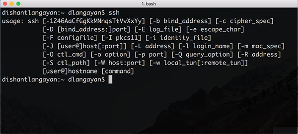
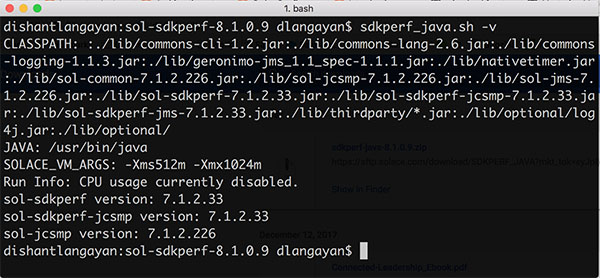
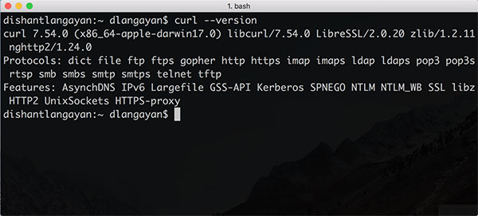

# ADMIN 101 - Introduction to Solace Administration

This guide contains prerequisites &amp; setup instructions for the Intro to Solace Administration (a.k.a ADMIN-101) public training course.

**NOTE:** You are required to bring your own laptop for performing hands-on lab exercises and viewing course material. Below instructions assume you have administrator privileges to install software and run Java-based programs on your laptops.

We suggest you download all the software ahead of the course.

## Table of Contents

* [Solace Virtual Message Router (Solace VMR)](#Solace-Virtual-Message-Router)
* [Required Software Tools](#Required-Software-Tools)

## Solace Virtual Message Router (Solace VMR)

You will need access to a Solace VMR to perform lab exercices for this course. You have several options:

1. [Solace VMR in the Cloud](#Solace-VMR-in-the-Cloud)
2. [Solace VMR on your laptop](#Solace-VMR-on-your-laptop)
3. [Solace VMR in AWS provided by us](#Solace-VMR-in-AWS-provided-by-us)

### Solace VMR in the Cloud

You can deploy a Solace VMR (free Community Edition) in several different [cloud providers](http://dev.solace.com/get-started/start-up-solace-messaging/), such as AWS, Azure, Google Cloud Platform, IBM Bluemix, etc.  

The quickest & easiest way to get started is in **AWS** using the quick start 1-Click launch wizard:

* [AWS Solace VMR 1-Click Launch wizard](https://aws.amazon.com/marketplace/pp/B077GRGL8Q)

Alternatively, you can also find the complete setup instructions here:

* [Setting up VMRs in AWS](https://docs.solace.com/Solace-VMR-Set-Up/Starting-VMRs-for-the-First-Time/Setting-Up-VMRs-in-AWS.htm)

### Solace VMR on your laptop

You will need a laptop with minimun 4 GiB of RAM, 2 CPUs, 8 GB disk space. If this is not an option for you, then see the next alternative option. If you have a laptop with good performance, than the easiest way is to download the Solace VMR Community Edition container and run it in Oracle VirtualBox. See the following Setup Guide for instructions:

* [Setting Up VirtualBox VMR Machine Images](http://dev.solace.com/get-started/start-up-solace-messaging/)

### Solace VMR in AWS provided by us

If none of the above options work for you, then reach out to us via email at [e-learning@solace.com](mailto:e-learning@solace.com) and we will provide you with a Solace VMR in our own AWS account. You will be given the login credential during the class.

**NOTE:** Once the training is over we will delete your Solace VMR, so you won't have access to it after the training. Hence we suggest the first two options, rather than us setting one up for you for the duration of the training.

## Required Software Tools

In addition to a Solace VMR, you will need to have the following software installed:

* **[SolAdmin](#SolAdmin)** - Solace's GUI-based administration tool to manage a Solace VMR
* **[PuTTY / any SSH Tools](#putty)** - for remote management of Solace VMR using command line
* **[Solace SDKPerf Tools](#sdkperf)** - pub/Sub test tool to send & receive messages
* **[Curl CLI Tool](#Curl)** - to send HTTP requests

### SolAdmin

SolAdmin is a Java-based GUI tool for administering and managing a Solace VMR. You can download and install SolAdmin from here:

* [http://dev.solace.com/downloads/#apis-protocols-tools](http://dev.solace.com/downloads/#apis-protocols-tools)

We will cover usage of SolAdmin on Day 1 of the course, so you need to ensure it is downloaded, installed and runnable on your laptop.

### PuTTY / an SSH Tools

If you use Mac/UNIX based OS then you will already have SSH install on your system. If you use a Windows based OS, then you can alternatively use PuTTY: [https://www.chiark.greenend.org.uk/~sgtatham/putty/latest.html](https://www.chiark.greenend.org.uk/~sgtatham/putty/latest.html)

### Solace SDKPerf Tools

SDKPerf is a pub/sub tool that you can use for testing, and sending & receiving of messages. We will use this throughout the course for most lab exercises. SDKPerf is available for different platforms and languages, but we suggest you download the Java version. **NOTE** *you will need Java JDK in order to run SDKPerf Java version.*

* [http://dev.solace.com/downloads/#apis-protocols-tools](http://dev.solace.com/downloads/#apis-protocols-tools)

### Curl CLI Tool

If you use Mac/UNIX based OS then you will already have Curl install on your system. 

Check by running `curl --verion` on your Terminal window. 

If you use a Windows based OS, then you can download Curl from here: (https://curl.haxx.se/dlwiz/)

